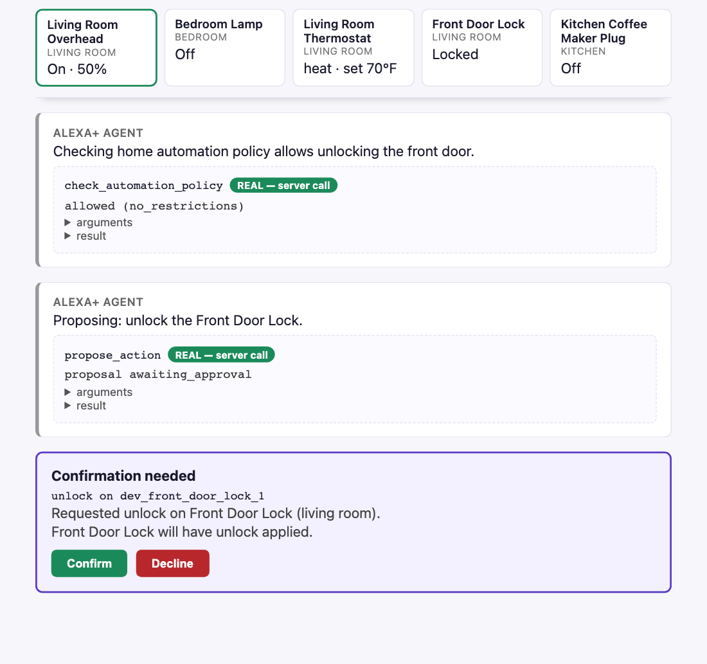

# alexa-plus: Smart Home Agent

An Alexa+ MCP server for the smart home where the agent proposes and only the owner's
Confirm can execute, plus a simulated Alexa+ web client that talks to it over the wire.

Built for the **Build, Ship, Shape: Amazon Developer Hackathon**, Alexa+ track.

- Devpost: https://devpost.com/software/smart-home-agent
- Demo video: https://www.youtube.com/watch?v=14YZX4JtDjY
- Live MCP server: `http://16.176.3.215:3000/mcp` (AWS EC2, `ap-southeast-2`; see
  [Known limitations](#known-limitations) for latency and for which build it runs)



**Try it now** — list the live server's eight tools with the off-the-shelf MCP Inspector
(needs Node.js; nothing to clone):

```bash
npx -y @modelcontextprotocol/inspector --cli http://16.176.3.215:3000/mcp --method tools/list
npx -y @modelcontextprotocol/inspector --cli http://16.176.3.215:3000/mcp --method tools/call --tool-name list_devices
```

## The problem

An agent that can unlock the front door can unlock it by mistake, or because something it
read told it to. MCP already gives hosts two ways to be careful: tool annotations
(`destructiveHint` and friends), which are hints a host may act on, and elicitation, which
is a way to ask the user. Neither one stops a call the host decides to make anyway, and a
confirmation step inside the agent's own loop is something the agent's side of the wire
can skip.

This entry makes approval an enforcement step instead. The agent can discover devices,
read state, check the home's automation policy and compose multi-device actions, and it
cannot change anything on its own: every change is a proposal, and executing one needs a
one-time token that only the owner can mint, on a route no MCP tool reaches, with a key
the agent never holds. Every executed action goes into an append-only audit log with the
actor and the reason.

**Who it is for.** Homes where more than one person has a say over the same devices:
households running several brands of device, renters and landlords sharing a smart lock,
and caregivers who need a record of who approved what. The route to them is an Alexa+
add-on, once the OAuth 2.1 + PKCE onboarding Alexa+ requires is built (not done yet, see
[Known limitations](#known-limitations)).

## How it works

The server (`server/`) exposes eight tools over MCP's Streamable HTTP transport (spec
revision `2025-11-25`), backed by a seeded 5-device registry (`server/data/devices.json`,
five fictional devices in three rooms):

| Tool | What it does | What it does NOT do |
|---|---|---|
| `list_devices` | Returns every device (or one room's): id, name, type, room, state, capabilities, supported actions. | Change any device, or invent devices that are not in the registry. |
| `get_device_state` | Returns one device's current state and `last_updated`. | Change state, cache, or predict. An unknown id is an error, not a guess. |
| `check_automation_policy` | Checks a proposed `{device_id, action, params}` against the policy and returns `{allowed, rule, reason}`. | Execute, override the policy, or write an audit entry. |
| `read_audit_log` | Returns executed actions, newest first, optionally for one device, capped at `limit` (default 50). | Write, delete or redact entries; list declined or unconfirmed proposals. |
| `propose_action` | Creates a proposal for one device action with its expected outcome, rationale and policy check. | Execute, change state, assume approval, or produce a usable token. |
| `execute_action` | Executes a proposed action, only with a one-time `confirmation_id` minted for that exact device/action/params; re-checks policy; writes an audit entry (`actor: "user"`). | Run without a valid, matching, unused token, or override the policy. |
| `compose_scene` | Creates one proposal covering several device actions (e.g. "Good Night"), each policy-checked; if any is denied, the whole scene is blocked. | Execute, persist the scene, or assume approval. |
| `execute_scene` | Executes a confirmed scene's actions in order, one audit entry per action. | Run without a matching token, skip the policy re-check, or roll back earlier actions if a later one fails. |

Proposing never changes state. Executing requires a one-time `confirmation_id` — a token
minted ONLY by the owner approving the proposal through the owner-key REST route below
(never through an MCP tool call, and never by the agent itself).
`execute_action`/`execute_scene` refuse — with a narrated reason, never a silent no-op —
a call with no token, a token that matches no pending proposal, an already-used token, a
token approved for a different action, or an action the automation policy denies at
execute time.

**Proposal REST routes (not MCP tools):** `POST /proposals/:id/approve` mints the
token; `POST /proposals/:id/reject` declines without ever minting one; `GET
/proposals/:id` reads a proposal's current status (never its token) and needs no key.
Approve and reject are the owner-only pair: they require the owner key the server was
started with (`OWNER_KEY`), sent as
`Authorization: Bearer <key>`: a missing or wrong key gets `401` and mints nothing, and a
server started without `OWNER_KEY` refuses every decision (`503`). A browser may call
`/proposals/*` only from an allowed origin (`OWNER_ORIGINS`, default the client's own
`http://127.0.0.1:5173` and `http://localhost:5173`); `/mcp` stays open to any MCP client.
The design called for owner-only `approve`/`reject` commands that are never registered on
the agent; this entry's client is a web page rather than a CLI, so they are REST routes,
and the client's Confirm/Decline buttons call them with the key.

**Tool annotations are hints; the token is the gate.** Each tool carries MCP annotations
(the four reads are `readOnlyHint`, the two proposers are not destructive, the two
executors are `destructiveHint`), so a host that prompts on hints can do so. The server
never relies on them: `execute_action`/`execute_scene` refuse without the owner's token
whatever a host does with the hints.

**Automation policy** (`server/src/policy.js`, pure and stateless): an unknown device is
denied (`unknown_device`), an action the device does not support is denied
(`unsupported_action`), brightness outside 0–100 is denied (`invalid_range`), and a
thermostat target outside 60–80°F is denied (`energy_limit`); anything else is allowed
(`no_restrictions`). A proposal the policy denies is created with status
`blocked_by_policy` and can never be approved. The execute tools re-run the policy
immediately before changing anything, so an approval cannot carry an action past a policy
that has changed since.

**State.** A proposal moves `awaiting_approval` → `approved` (token minted) → `executed`
(token consumed), or `awaiting_approval` → `rejected`. An audit entry records
`entry_id`, `timestamp`, `device_id`, `action`, `params`, `actor`, `reason`, `result`
and the device's `new_state`. Devices, proposals and the audit log live in memory for
the life of the server process.

The client (`client/`) is a separate project — its own `package.json`, its own
`npm install`/`npm start`/`npm test` — that imports nothing from `server/` and reaches it
only over HTTP. It renders an Alexa+-style conversation and walks the demo script
(below) with a scripted planner (no LLM required): every tool call it makes is a live
`fetch()` to the running server, and a proposed action pauses the conversation until you
click Confirm or Decline right there in the page — the demo runs one confirmed action
(dimming the living room light) and one declined action (unlocking the front door). A row
of device tiles above the conversation shows each device's state, rebuilt from the real
tool results the conversation received (`client/src/device-state.js`), so a Confirm
visibly moves the light to 50% and a Decline visibly leaves the door locked. Each tool
call's arguments and JSON result are one click away rather than expanded.

[docs/architecture.md](docs/architecture.md) has the component diagram, the approval-gate
sequence diagram, the full refusal matrix with the test that covers each row, and how
this server maps onto Amazon's Alexa+ MCP onboarding requirements.

**Stack:** Node.js (server >= 20, client >= 20.10, since its test script uses
`--test-concurrency`) and npm. Server: Express 5 with the official
`@modelcontextprotocol/sdk` and Zod; tests with Jest and Supertest; lint with ESLint.
Client: React 18 loaded from a CDN import map (no bundler, no build step); tests with
Node's built-in `node:test`.

## Setup

```bash
npm install
```

Pick an owner key: any long random string. The server and the client must be started
with the same one.

```bash
export OWNER_KEY="$(node -e "console.log(require('node:crypto').randomBytes(24).toString('hex'))")"
echo "$OWNER_KEY"   # copy it into the client's terminal below
```

## Run

```bash
npm start
```

Starts the MCP server on `http://127.0.0.1:3000/mcp` (override the port with `PORT=<n>`).
The endpoint accepts `POST`, `GET`, and `DELETE` per the Streamable HTTP transport spec.
Without `OWNER_KEY` the server still runs, but refuses every approve and decline.
If the client runs on another port or host, list its origin in `OWNER_ORIGINS`
(comma-separated) so the browser may call the owner routes.

## Test

```bash
npm test
```

Runs the conformance suite in `server/test/` (47 tests in 7 suites): initialize
handshake, `tools/list` (including each tool's annotations), `tools/call` (including the
unknown-device and unknown-tool error paths, and a no-mutation check against the seeded
registry), session lifecycle (session id issuance, reuse, `DELETE` termination, and the
400-vs-404 distinction between a missing and a terminated/unknown session id), the
propose→approve/reject→execute lifecycle for both single actions and scenes, the policy
rules, and every way an `execute_action`/`execute_scene` call can be refused (no
`confirmation_id`, a token that matches no pending proposal, a proposal that was never
approved, a replayed already-used token, a token approved for a different action, and a
policy that denies the action at execute time), plus the owner-only `approve`/`reject`
routes themselves refusing an unknown or already-decided proposal, a missing or wrong
owner key, a server with no owner key, and a browser on an origin that is not allowed.

## Lint

```bash
npm run lint
```

## Verify

```bash
bash verify.sh
```

Checks the root files, the MIT `LICENSE`, this README's sections and the submission
write-up, then runs the server's lint and tests, confirms `client/` imports nothing from
`server/`, and runs the client's tests.

## Simulated Alexa+ client

In a second terminal, with the server already running from the steps above and the same
`OWNER_KEY` exported:

```bash
cd client && npm install && npm start
```

Then open `http://127.0.0.1:5173` in a browser (override the client's own port with
`PORT=<n>`; it defaults to talking to the server at `http://127.0.0.1:3000/mcp`, editable
in the page). Click "Start demo conversation" to run the demo script. It
will pause twice with a "Confirmation needed" panel — click **Confirm** the first time
(dimming the living room light — this one actually executes, and the light's tile moves
to 50%) and **Decline** the second time (unlocking the front door — the agent narrates
that the door stays locked, and its tile never changes).

`client/server.js` templates `OWNER_KEY` into the page it serves, because the page's own
Confirm and Decline buttons are what send it. That is why it listens on `127.0.0.1` only
(`HOST` overrides that; don't point it at a public interface) and serves nothing to a
request whose `Host` header names another machine. If the client has no key,
the page says so and the server refuses its Confirm.

`client/` has no bundler or build step — React loads from a CDN import map in
`index.html`. Its one npm dependency, `@aws-sdk/client-bedrock-runtime`, is used only by
`client/server.js` under `PLANNER=bedrock` (see below), so `npm install` there does real
work; "one command each" (`npm install && npm start`) still works identically for server
and client.

To run the client's own tests (25 tests; the integration tests spawn the real server as a
separate process and drive the full script against it over HTTP, including a scripted
confirm, a scripted decline, and a client without the owner key being refused):

```bash
cd client && npm test
```

## PLANNER=bedrock — the Bedrock tool-use-loop planner

The scripted planner above is the default and needs no LLM. An alternative planner lets
a real model (Amazon Bedrock's Converse API, tool-use loop) choose which tools to call
and in what order, instead of walking a fixed script — set it when starting the client:

```bash
PLANNER=bedrock AWS_REGION=ap-southeast-2 BEDROCK_MODEL_ID=amazon.nova-micro-v1:0 npm start
```

All three env vars are optional (defaults shown above — `AWS_REGION` defaults to
`ap-southeast-2`, `BEDROCK_MODEL_ID` to `amazon.nova-micro-v1:0`). Nova Micro is the
cheapest Bedrock model confirmed to support Converse tool-use as of 2026-09-10
($0.035/$0.14 per 1M input/output tokens); Claude Haiku 4.5 also supports it at roughly
30x the cost (~$1/$5), and the original default, Claude 3.5 Sonnet, is no longer in
Bedrock's model catalog. `ap-southeast-2` hosts Nova Micro in-Region, with no cross-region inference
profile needed. The tradeoff: Nova Micro is a much smaller model, so its tool-call
reliability on complex turns is less proven — override `BEDROCK_MODEL_ID` if that shows
up.

`client/server.js` reads all three once at startup, but only `PLANNER` and
`BEDROCK_MODEL_ID` get templated into `window.__ALEXA_PLUS_CONFIG__` in the served HTML
(`app.js` reads that global and dynamically imports `client/src/bedrock-planner.js` only
when `planner: 'bedrock'`). `AWS_REGION` is deliberately not templated — it only
matters to the real `BedrockRuntimeClient` `server.js` constructs for itself, and the
browser never constructs one at all.

What does **not** change: **no AWS credentials are ever read, embedded, or reachable by
browser-served code.** The browser never constructs an AWS SDK client at all — it POSTs
the Converse request to this same origin's `POST /bedrock/converse` (`client/server.js`),
which is the one place `BedrockRuntimeClient` is actually constructed, under Node, where
the AWS SDK's standard credential chain (environment variables, `~/.aws/credentials`,
IMDS) can resolve safely. Every tool call the model makes still goes through the exact
same `mcpClient.callTool()` chokepoint the scripted planner and the UI use, and every
proposed action still has to pass through the exact same human Confirm/Decline gate to
get a `confirmation_id` — the model can reason about anything, but it can never mint its
own token, redirect an execution to a different device/action than what was actually
proposed and confirmed, replay a token, or clobber one pending proposal with another when
two are in flight at once (see `client/src/bedrock-planner.js`'s header comment for
exactly how that's enforced). `npm test` needs no LLM key and makes no network call to
AWS: `client/test/bedrock-planner.test.js` and `client/test/bedrock-proxy-route.test.js`
both drive the loop and the proxy route respectively against a mocked `bedrockClient`
returning scripted Converse-shaped responses.

**Live browser execution works (corrected 2026-09-11).** An earlier version of this
section documented the opposite as a "known, deliberate gap" — that was true at the time
(the browser tried to construct `BedrockRuntimeClient` itself, which cannot resolve
credentials and cannot even resolve the SDK's import without a bundler) but was never
actually verified live until the client was opened in a real browser tab and failed
exactly that way. The fix moved the AWS call server-side; a real click-through now gets
as far as a real AWS SDK error (e.g. `Could not load credentials from any providers`, on
a machine with no local AWS credentials configured) delivered cleanly through the UI's
normal error path, not a browser crash. Getting an actual model response additionally
needs the machine running `npm start` in `client/` to have real AWS credentials
available to the Node process (local `~/.aws/credentials` / env vars in dev, an IAM role
if this process is ever deployed). Separately, the same Converse call shape was run
against real AWS from AWS CloudShell with that environment's own credentials and returned
a genuine tool-use decision (`list_devices`) with `HTTP 200`.

What has **not** been run yet is the whole loop with a real model: `PLANNER=bedrock`
choosing tools against this MCP server and stopping at the Confirm gate, with real
credentials. The next section is the one-command way to do that.

### `bedrock-cli.js` — the Bedrock planner in a terminal

`client/bedrock-cli.js` runs the same `runBedrockConversation()` loop under Node, with
the person at the terminal as the confirm gate (type `c` or `d` at each proposal), and
prints a transcript: every tool the model called with its real result, and every gate
decision. It is meant for a shell that already holds AWS credentials, such as AWS
CloudShell, so no browser and no local credential file is involved:

```bash
# server, in the background (or point the CLI at a running one)
OWNER_KEY="$OWNER_KEY" PORT=3000 node server/src/server.js &
cd client && npm install
OWNER_KEY="$OWNER_KEY" AWS_REGION=ap-southeast-2 node bedrock-cli.js http://127.0.0.1:3000/mcp \
  "Dim the living room light to 50%, then unlock the front door, then show me the audit log." \
  | tee bedrock-transcript.txt
```

The transcript goes to stdout and the Confirm/Decline prompts to stderr, so the prompts
still show in the terminal while `bedrock-transcript.txt` holds only the transcript. Every
run makes a few real, metered Converse calls. `client/test/bedrock-cli.test.js` drives it
against the real server with only the Bedrock client mocked, through the same terminal
wiring on in-memory streams.

## Inspecting with an off-the-shelf MCP client

With the server running (`npm start` in one terminal), use the reference MCP Inspector
CLI from another terminal to list and call the tools directly — no custom client code
needed:

```bash
npx -y @modelcontextprotocol/inspector --cli http://127.0.0.1:3000/mcp --method tools/list
npx -y @modelcontextprotocol/inspector --cli http://127.0.0.1:3000/mcp --method tools/call --tool-name list_devices --tool-arg room=kitchen
npx -y @modelcontextprotocol/inspector --cli http://127.0.0.1:3000/mcp --method tools/call --tool-name get_device_state --tool-arg device_id=dev_thermostat_1
```

The same commands work against the live deployment: replace `http://127.0.0.1:3000/mcp`
with `http://16.176.3.215:3000/mcp`. The deployed server is shared by everyone who calls
it, so stick to the read-only tools there. It is an MCP endpoint, not a web page, so opening it
in a browser returns HTTP 400 (`Missing Mcp-Session-Id header`): every MCP session starts
with an `initialize` POST, which the Inspector sends for you.

`tools/list` against a live server returns all eight tools:

```
 - list_devices
 - get_device_state
 - check_automation_policy
 - read_audit_log
 - propose_action
 - execute_action
 - compose_scene
 - execute_scene
TOTAL: 8
```

## Demo walkthrough

The demo script, as the simulated client runs it:

1. The page starts idle. The registry behind it holds five devices: living room light,
   bedroom lamp, thermostat, front door lock (locked), kitchen coffee maker plug.
2. The user asks: "Turn on the living room light and set it to 50% brightness, then
   check the thermostat."
3. The agent calls `list_devices` (the device tiles fill in), reads the light's state,
   calls `check_automation_policy`, then `propose_action` to dim the light to 50%.
4. The conversation stops on a "Confirmation needed" panel showing the proposal's
   expected outcome and rationale. Nothing has changed yet.
5. The person clicks **Confirm**; only now is a one-time token minted, with the owner key.
6. The agent calls `execute_action` with that token. The light's new state (brightness
   50) comes back, its tile moves to 50%, and an audit entry records `actor: "user"`.
7. The agent checks the thermostat.
8. The user adds: "Also unlock the front door." The agent checks the policy and proposes
   it, and the same panel appears.
9. The person clicks **Decline**. The agent says the door stays locked and never calls
   `execute_action` for it; the lock's tile still reads Locked.
10. The agent reads the audit log: one entry, the light. Both outcomes of the same gate
    in one run.

Below is a real transcript captured by driving `client/src/planner.js` against a freshly
started server, confirming the first proposal and declining the second — the same code
path the browser UI uses, with the button clicks scripted instead of clicked. Abridged by
truncating long JSON payloads (marked `…`) and leaving out turns 3, 8 and 10 (two state
reads and a policy check); nothing is paraphrased.

```
[1] USER: Turn on the living room light and set it to 50% brightness, then check the thermostat.

[2] AGENT: Let me see what devices are in the home.
    tool: list_devices  args={}
    -> {"devices":[{"device_id":"dev_living_room_light_1","name":"Living Room Overhead", …5 devices…]}

[4] AGENT: Checking home automation policy allows dimming this light.
    tool: check_automation_policy
    -> {"allowed":true,"rule":"no_restrictions","reason":""}

[5] AGENT: Proposing: dim Living Room Overhead to 50% brightness.
    tool: propose_action  args={"device_id":"dev_living_room_light_1","action":"set_brightness","params":{"brightness":50}}
    -> {"proposal_id":"prop_e41e087e-…","status":"awaiting_approval","confirmation_token":null, …}

[6] SYSTEM confirm gate -> proposal prop_e41e087e-… (set_brightness)
    person clicks: CONFIRM

[7] AGENT: Executing the confirmed action.
    tool: execute_action  args={…,"confirmation_id":"confirm_1084393f-…"}
    -> {"device_id":"dev_living_room_light_1","new_state":{"power":"on","brightness":50,"color_temp_k":4000},"result":"success","audit_entry_id":"audit_5d2f9672-…"}

[9] USER: Also unlock the front door.

[11] AGENT: Proposing: unlock the Front Door Lock.
    tool: propose_action  args={"device_id":"dev_front_door_lock_1","action":"unlock","params":{}}
    -> {"proposal_id":"prop_eae09d4d-…","expected_outcome":"Front Door Lock will have unlock applied.","status":"awaiting_approval", …}

[12] SYSTEM confirm gate -> proposal prop_eae09d4d-… (unlock)
    person clicks: DECLINE

[13] AGENT: Understood — the Front Door Lock stays locked. Nothing changed.

[14] AGENT: Here is the audit log for everything that actually executed this session.
    tool: read_audit_log  args={}
    -> {"entries":[{"entry_id":"audit_5d2f9672-…","device_id":"dev_living_room_light_1",
        "action":"set_brightness","actor":"user","reason":"User approved via prop_e41e087e-…",
        "result":"success","new_state":{"power":"on","brightness":50,"color_temp_k":4000}}]}
```

Two things to notice. The declined unlock produced **no** audit entry — the log ends with
exactly one — and the door stayed locked. And nothing between the proposal and the
person's click changed any state.

The other half of the gate is what happens when a caller skips the person entirely:
first an `execute_action` with no token, then an approve call without the owner key.
Against the same running server:

```
BEFORE   {"device_id":"dev_front_door_lock_1","state":{"locked":true,"battery_pct":82},"last_updated":"2026-09-08T08:00:00Z"}
REFUSAL isError=true
        execute_action requires a confirmation_id minted by the person confirming a
        pending proposal in the client. Call propose_action first and wait for their
        decision — this call was refused, nothing changed.
APPROVE (no owner key) HTTP 401 {"error":"Only the home owner can approve or decline a proposal:
        send the owner key as \"Authorization: Bearer <key>\". Nothing was minted or changed."}
AFTER    {"device_id":"dev_front_door_lock_1","state":{"locked":true,"battery_pct":82},"last_updated":"2026-09-08T08:00:00Z"}
AUDIT entries=1
```

Same state, same `last_updated`, same audit count. The refusal is a true no-op, not a
warning printed beside a change that happened anyway.

## Known limitations

Stated plainly, because a submission that hides these is worse than one that names them.

- **Deployed, with latency that depends on where you are.** Live at
  `http://16.176.3.215:3000/mcp`, an AWS EC2 instance (`t3.micro`, Amazon Linux 2023,
  `ap-southeast-2`) — the region a `us-east-1` / App Runner Organizations restriction on
  this AWS account ruled out. Verified with a real `initialize` handshake: `HTTP 200`,
  correct `protocolVersion`/`capabilities`/`serverInfo`. Measured end-to-end latency
  from a US-based test origin is **570–700 ms**, over the Alexa+ track's 500 ms line —
  curl's own timing breakdown shows this is 100% network distance to `ap-southeast-2`
  (TCP connect alone is ~290 ms, one full round trip), not server processing: the
  loopback `tools/call` round-trip is still 0.62–1.17 ms, unchanged. A judge testing
  from within Australia/APAC would see this comfortably under 500 ms; a US/EU tester
  will see the same geography this measurement did. The endpoint is plain HTTP, not
  HTTPS. [docs/deploy.md](docs/deploy.md) says what is deployed and keeps the App Runner
  artifacts and runbook that could not be used on this account.
- **The live server runs the build from before the owner key.** It was deployed on
  2026-09-11; the owner key on `approve`/`reject` came later. Until the instance is
  redeployed ([docs/deploy.md](docs/deploy.md) has the steps), anyone who knows a pending
  proposal's id can approve it on the public host, and its tools carry no annotations.
  The MCP tool surface itself has never been able to reach the approve route.
- **One owner key, not user accounts.** The owner routes check a single shared secret.
  There is no per-person identity, so the audit log's `actor` is `"user"` for every
  confirmed action, whoever clicked. OAuth 2.1 with PKCE is not implemented (an `auth.js`
  for it was planned and deliberately deferred); the MCP endpoint itself requires no
  credentials, and a real Alexa+ add-on would need that flow before account linking.
- **Not the Alexa+ MCP Toolkit.** This is a self-hosted MCP server plus a *simulated*
  Alexa+ client. Every tool call in that client is a real call to the real server, but no
  Alexa device is in the loop.
- **All state is in memory.** Devices, proposals and audit entries live for the life of
  the server process; restarting re-reads `server/data/devices.json` and forgets
  everything else. Nothing is written back to disk. This is deliberate, not an
  unfinished persistence layer. On the shared deployed server, every caller sees the same
  registry and audit log.
- **The default planner is scripted, not reasoning.** It walks a fixed conversation so
  the demo and tests run identically with no LLM and no API key. The `PLANNER=bedrock`
  planner reasons for real, but it needs AWS credentials on the machine running the
  client, and the automated tests exercise it only against a mocked Bedrock client. No
  run of the full loop with a real model has been recorded yet (`bedrock-cli.js` above is
  the way to record one).
- **`execute_scene` does not roll back.** If a later action in a scene fails, the earlier
  ones stay applied; the tool stops and reports exactly how far it got. Its description
  says so.

## Privacy and security notes

- **No personal data, anywhere.** The five devices in `server/data/devices.json` are
  fictional, in a fictional house. No real address, account, network identifier or person
  appears in any source file, test, or fixture.
- **Two credentials, each held where it is used.** The MCP tools and both planners read
  no API key, token or password. The first credential is `OWNER_KEY`: the server reads it
  from its environment and compares it (as SHA-256 digests, with `timingSafeEqual`) on
  `approve`/`reject` only; the client's local page (or `bedrock-cli.js`, from its own
  environment) carries it for its own Confirm and Decline, and `McpHttpClient` keeps it in a private field that it sends only to those two
  routes, never on a `tools/call`. It is never logged or written to disk. The second is
  AWS, under `PLANNER=bedrock`: `client/server.js`'s `POST /bedrock/converse` resolves an AWS
  credential the normal Node way (local `~/.aws/credentials` / env vars in dev, an IAM
  role if ever deployed) to call Bedrock. That credential is held only in that Node
  process's own environment, is never logged, written to disk, or echoed in any
  response, and — the property that actually matters here — is structurally unreachable
  from browser-served code: the browser only ever POSTs a Converse request and reads back
  its JSON result, the same origin, no credential in either direction. `/bedrock/converse`
  has no auth or rate limit of its own; `client/server.js` listens on `127.0.0.1` by
  default and answers only a `Host` header naming this machine (below), and because this
  route is a real, metered AWS call, that default matters — don't set `HOST` to a public
  interface.
- **No outbound network calls, with the same exception.** Every tool resolves against the
  in-memory registry; the server contacts no device, vendor API, or third-party service.
  The browser's only external fetch is loading React from a CDN via the import map in
  `client/index.html`. Under `PLANNER=bedrock`, `client/server.js` additionally makes one
  outbound call per conversation turn to Amazon Bedrock — the one deliberate exception,
  and never anything else.
- **Authorization is structural, not advisory.** `ProposalStore.approve()` is the only
  code that ever mints a `confirmation_token`, and its only caller is the
  `POST /proposals/:id/approve` route, which requires the owner key. No MCP tool wraps it,
  so no agent tool call can reach it, and an HTTP caller without the key is refused with
  `401`. Tokens are single-use: `markExecuted` nulls the token, so a replay is refused.
- **Tokens are not echoed back.** `GET /proposals/:id` strips `confirmation_token` before
  responding — the token is returned exactly once, to the caller that minted it.
- **Policy is re-checked at execute time**, never trusted from an earlier
  `check_automation_policy` call, so an approval cannot be used to smuggle through an
  action the policy would now deny. `execute-refusals.test.js` proves it by switching the
  policy to deny between the approval and the execute call.
- **The audit log is append-only.** There is no delete or redact path in `audit.js`;
  `read_audit_log` is its only reader.
- **Host-header validation is off, deliberately.** The SDK's DNS-rebinding protection
  defaults to rejecting any request whose `Host` is not `localhost`/`127.0.0.1` — true
  until this demo was actually deployed to a real address, at which point that check
  refused every request from its own public IP with `HTTP 403 Invalid Host`. Disabled
  via `createMcpExpressApp({ host: '0.0.0.0' })` in `server/src/server.js`, the same
  tradeoff already made for `/mcp`'s CORS below: the agent surface has no auth and no
  origin allowlist, so this one check wasn't real protection, just an accident of the
  SDK's localhost-only default. The owner routes are protected by the owner key instead.
- **CORS: open on `/mcp`, allowlisted on `/proposals/*`.** `/mcp` answers any origin
  (`Access-Control-Allow-Origin: *`), because any MCP client may connect and the demo runs
  two processes on two ports. `/proposals/*` echoes `Access-Control-Allow-Origin` only for
  the origins in `OWNER_ORIGINS`, on top of the owner key.
- **The client's static server serves only `client/`**, from a fixed extension allowlist,
  rejects any resolved path outside its own directory, and listens on `127.0.0.1` by
  default, since the page it serves carries the owner key. Binding to loopback does not
  stop DNS rebinding (a page on some other domain that re-resolves to `127.0.0.1` would
  load this page as its own origin), so every route also answers `403` unless the `Host`
  header is `127.0.0.1`, `localhost`, `[::1]` or `HOST`, on the port it listens on.
  `client/test/server-config.test.js` checks this.

## License

MIT — see [LICENSE](LICENSE).

## Documentation

| Document | What it is |
|---|---|
| [docs/architecture.md](docs/architecture.md) | Architecture diagrams (Mermaid + exported SVG), the approval-gate sequence, the refusal matrix, and how to onboard this server to Alexa+. |
| [docs/submission.md](docs/submission.md) | The Devpost write-up: text description, Built With, every form field, and the hackathon's submission checklist answered line by line with evidence. |
| [docs/deploy.md](docs/deploy.md) | What is deployed (EC2), how to redeploy it with the owner key, an HTTPS option, and the App Runner container build and runbook. |
| [docs/feedback.md](docs/feedback.md) | Product feedback on every tool, API and SDK used, including Amazon Bedrock, its AWS SDK client, AWS EC2 and App Runner. |
| [docs/friction-log.md](docs/friction-log.md) | Seven friction-log entries in the hackathon's requested format, three of them on AWS. |
| [docs/video-script.md](docs/video-script.md) | Demo video script, shot list, and timing budget. |
