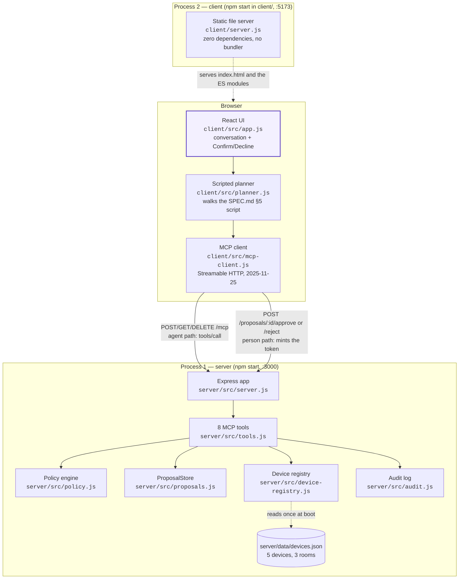
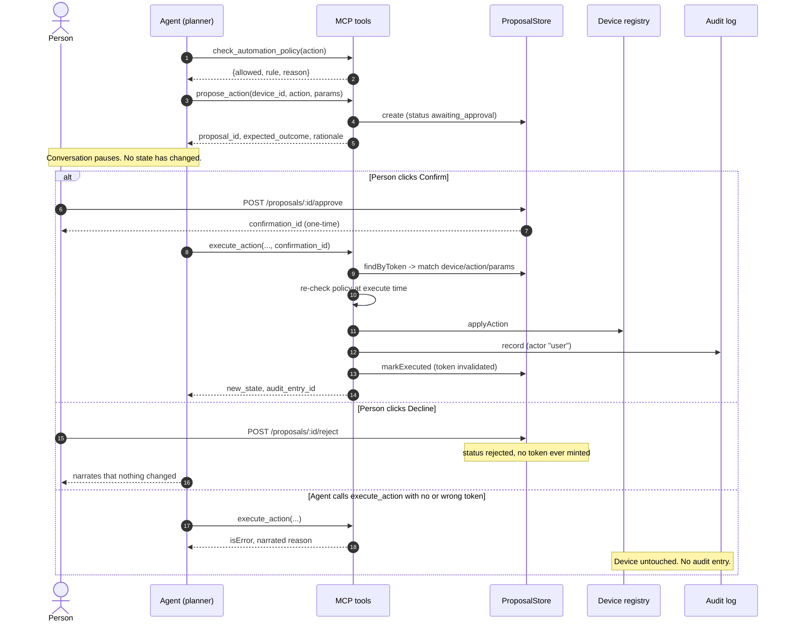

# Architecture — alexa-plus Smart Home Agent

The submission's architecture diagram and the reasoning behind it. Everything on this
page is checkable against the code in `../server/` and `../client/`; file and symbol
names are given so a reader can go look.

Both diagrams below are Mermaid source, so GitHub renders them inline. They are also
exported as standalone images for submission forms that want an image file rather than a
repository link — see [Exported images](#exported-images).

---

## 1. Components and processes

Two independent Node processes, one browser, and exactly one wire between them.



**The one thing this diagram is drawn to show:** there are two arrows from the client to
the server, not one, and they mean different things.

- The **agent path** (`tools/call` on `/mcp`) is how every tool the agent uses is
  reached. `client/src/planner.js` routes every turn through the single
  `McpHttpClient.callTool()` — the UI has no second, private way to reach the server.
- The **person path** (`POST /proposals/:id/approve|reject`) is plain REST, deliberately
  **not** an MCP tool. Nothing registered on the agent can reach it. That is what makes
  "only a person can mint a confirmation token" a structural property rather than a
  promise: `ProposalStore.approve()` in `server/src/proposals.js` is the only code that
  ever sets `confirmation_token`, and its only caller is the owner-only route in
  `server/src/server.js`.

`client/` imports nothing from `server/` — it talks to it only over HTTP, which
`verify.sh` enforces with a cross-import grep.

---

## 2. The approval gate

The propose → confirm → execute lifecycle, including what happens when the person says
no and what happens when an agent tries to skip them.



### The refusal matrix

`execute_action` / `execute_scene` refuse — with a narrated `isError` result, never a
silent no-op — in every one of these cases:

| Refusal | Where it is enforced | Test |
|---|---|---|
| No `confirmation_id` at all | `tools.js`, first guard | `execute-refusals.test.js` (action and scene) |
| Token matches no proposal | `ProposalStore.findByToken` returns nothing | `execute-refusals.test.js` (action and scene) |
| Proposal was never approved | status check (`!== 'approved'`) | `execute-refusals.test.js` |
| Token already used (replay) | `markExecuted` nulls the token | `execute-refusals.test.js` |
| Token approved for a different device/action/params | field comparison before execution | `execute-refusals.test.js` |
| An action token used against `execute_scene` (kind mismatch) | `proposal.kind` check | `execute-refusals.test.js` |
| A rejected proposal executed anyway | status is `rejected`, token never existed | `execute-refusals.test.js` |
| Approve/reject an unknown or already-decided proposal | `ProposalStore.approve`/`reject` return `{ok: false}` → HTTP 409 | `execute-refusals.test.js` (4 cases) |
| Policy denies at execute time | `checkAutomationPolicy` re-run, not trusted from the earlier check | **No direct test — see below** |

The last row is the one honest gap in that matrix, and it is a gap for a reason worth
stating rather than hiding. The guard is real (`tools.js` re-runs
`checkAutomationPolicy` immediately before `applyAction`), but today it cannot be
reached: `policy.js` is pure and stateless, and a proposal the policy denies is created
`blocked_by_policy` and can never be approved, so no approved token can exist for an
action the policy would refuse. The re-check is defence for a future in which policy
becomes time- or state-dependent — the case SPEC.md §3 anticipates with time-based
schedules and user overrides — at which point it becomes both reachable and testable.
The policy engine's own rules are unit-tested directly in `../server/test/policy.test.js`,
and the scene-level "any blocked action blocks the whole scene" path in
`../server/test/proposal-lifecycle.test.js`.

A proposal the policy already denies is created with status `blocked_by_policy` and can
never be approved, so a denied action cannot reach a person as a confirmable choice.

---

## 3. State and its lifetime

Per SPEC.md §4, all state is in memory for the life of the server process.

| Thing | Lives in | Lifetime | Written by |
|---|---|---|---|
| Device registry | `DeviceRegistry._devices` | process | `applyAction`, only from a confirmed execute |
| Proposals + tokens | `ProposalStore._proposals` | process | `createAction`/`createScene`, `approve`/`reject`, `markExecuted` |
| Audit entries | `AuditLog._entries` | process | `record`, append-only — there is no delete or redact path |
| Seed data | `server/data/devices.json` | on disk, read once at boot | nothing; never written back |

`DeviceRegistry.applyAction` replaces a device with a new frozen snapshot rather than
mutating in place, so an audit entry that captured an earlier state still reads exactly
as it was recorded.

Sessions are separate from state: each MCP HTTP session gets its own `McpServer`, but
all sessions share one registry, one proposal store, and one audit log — a proposal made
in one session is still approvable after a client reconnects with a new session id.

---

## 4. Onboarding this MCP server to Alexa+

What Amazon's Alexa+ MCP documentation requires, and where this entry stands against
each requirement. Sources:
[MCP QuickStart](https://developer.amazon.com/docs/alexaplus/add-ons/mcp-toolkit-quickstart.html),
[MCP Toolkit overview](https://developer.amazon.com/docs/alexaplus/add-ons/mcp-toolkit-overview.html),
[Account linking for category MCP add-ons](https://developer.amazon.com/docs/alexaplus/add-ons/category-sdk-mcp-account-linking.html).

| Requirement | This server |
|---|---|
| Streamable HTTP transport (the 2025-11-25 spec deprecated HTTP+SSE) | **Met.** `PROTOCOL_VERSION = '2025-11-25'` in `server/src/server.js`; `/mcp` answers POST, GET and DELETE, and session-lifecycle conformance is covered by `server/test/session-lifecycle.test.js`. Verified independently with the off-the-shelf MCP Inspector CLI, which lists all 8 tools. |
| MCP introspection over JSON-RPC 2.0 discovers the tools | **Met.** `tools/list` returns 8 tools, each with a title, a description written for a model that cannot see the screen, and a JSON Schema generated from its Zod input schema (`server/test/tools-list.test.js`). |
| Round-trip query latency under 500 ms | **Met on latency, not on hosting.** Measured `tools/call` round-trip on loopback: 0.62–1.17 ms across 5 samples. Every call resolves against an in-memory registry, so there is no network- or provider-bound step. But the server is not deployed to a public URL — see the limitation below. |
| Reachable at a remote URL | **Not met.** The server is run locally and has no public URL. Its socket listens on all interfaces, but the SDK's DNS-rebinding protection rejects any request whose `Host` header is not `localhost`/`127.0.0.1` — verified: `Host: evil.example.com` gets `HTTP 403 {"error":{"code":-32000,"message":"Invalid Host: evil.example.com"}}` — so in practice only local clients are served. Deploying is an owner-only step (see the repo's `CLAUDE.md` human-only gates). |
| OAuth 2.1 authorization-code flow with PKCE (S256) | **Not implemented.** This server requires no authentication at all, so nothing about the demo is gated behind an auth path that does not exist. SPEC.md §7 records `auth.js` as deliberately deferred. A real Alexa+ add-on would need it before account linking. |
| Onboarding via the Alexa AI CLI (browser sign-in with Login with Amazon; `--no-browser` for headless) | **Owner step.** It authenticates against a developer account, which is a human-only action for this repo. |

**What this entry does and does not claim.** It does not use the Alexa+ MCP Toolkit and
does not ship an Agent Skill. It takes the other route the hackathon rules allow for this
track: a self-hosted MCP server on the required spec revision and transport, plus a
simulated Alexa+ experience in a web app driving it with agentic tools. Every tool call
in that simulated client is a real call to the real server — nothing is mocked — but the
Alexa surface itself is simulated, and this document says so rather than implying an
Alexa device was in the loop.

---

## Exported images

`architecture-1.svg` (components) and `architecture-2.svg` (the approval gate) are
generated from the Mermaid blocks on this page:

```bash
npx -y @mermaid-js/mermaid-cli -i docs/architecture.md -o docs/architecture.svg
```

Run it from `entries/alexa-plus/` after editing a diagram, so the images and the source
never disagree.
