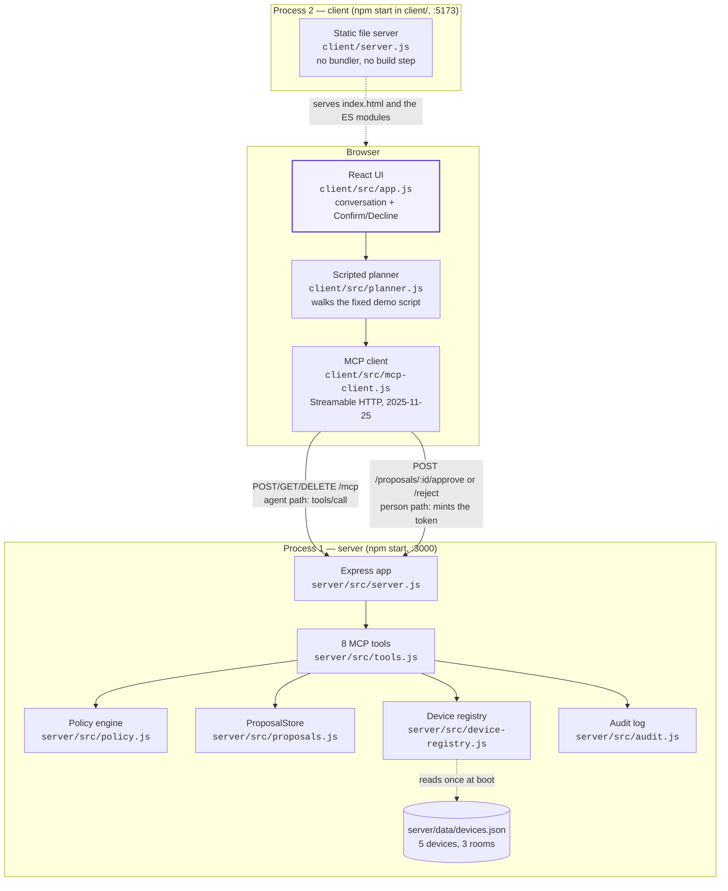
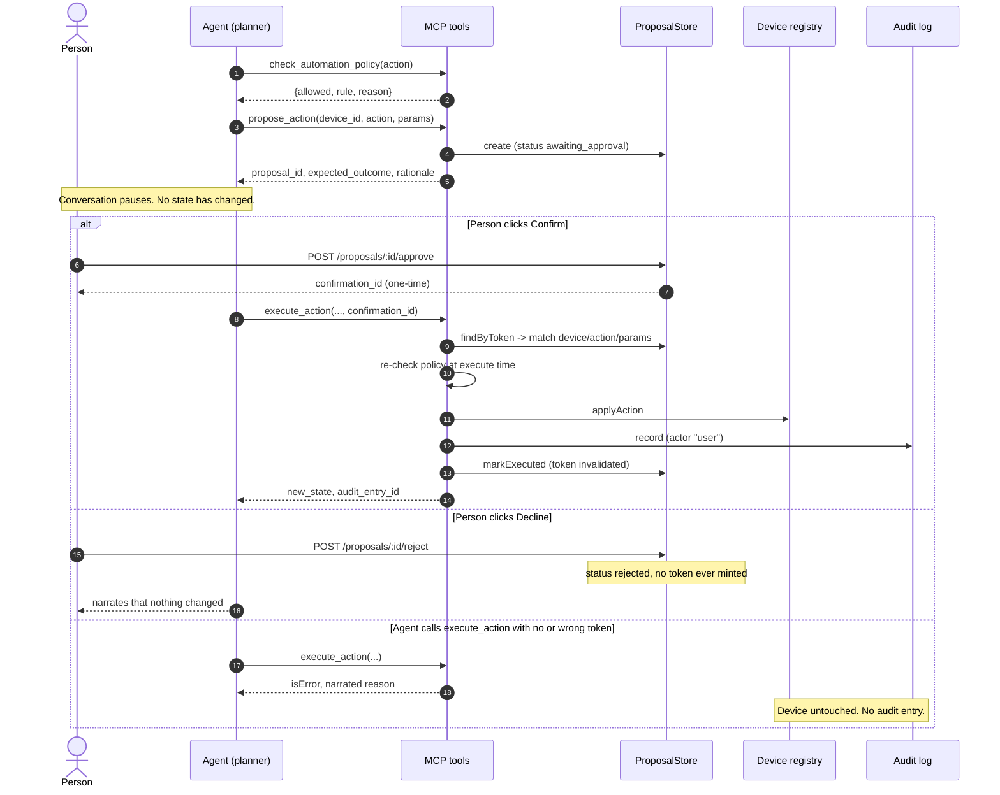

# Architecture — alexa-plus Smart Home Agent

The submission's architecture diagram and the reasoning behind it. Everything on this
page is checkable against the code in `../server/` and `../client/`; file and symbol
names are given so a reader can go look.

Both diagrams below are Mermaid source, so GitHub renders them inline. They are also
exported as standalone images for submission forms that want an image file rather than a
repository link — see [Exported images](#exported-images).

---

## 1. Components and processes

Two independent Node processes, one browser, and exactly one wire between them.


```mermaid
graph TB
    subgraph browser["Browser"]
        UI["React UI<br/><code>client/src/app.js</code><br/>conversation + Confirm/Decline"]
        PLAN["Scripted planner<br/><code>client/src/planner.js</code><br/>walks the fixed demo script"]
        MCPC["MCP client<br/><code>client/src/mcp-client.js</code><br/>Streamable HTTP, 2025-11-25"]
        UI --> PLAN
        PLAN --> MCPC
    end

    subgraph cproc["Process 2 — client (npm start in client/, :5173)"]
        STATIC["Static file server<br/><code>client/server.js</code><br/>no bundler, no build step"]
    end

    subgraph sproc["Process 1 — server (npm start, :3000)"]
        EXPRESS["Express app<br/><code>server/src/server.js</code>"]
        TOOLS["8 MCP tools<br/><code>server/src/tools.js</code>"]
        POLICY["Policy engine<br/><code>server/src/policy.js</code>"]
        PROPS["ProposalStore<br/><code>server/src/proposals.js</code>"]
        REG["Device registry<br/><code>server/src/device-registry.js</code>"]
        AUDIT["Audit log<br/><code>server/src/audit.js</code>"]
        SEED[("server/data/devices.json<br/>5 devices, 3 rooms")]
        EXPRESS --> TOOLS
        TOOLS --> POLICY
        TOOLS --> PROPS
        TOOLS --> REG
        TOOLS --> AUDIT
        REG -.->|"reads once at boot"| SEED
    end

    STATIC -.->|"serves index.html and the ES modules"| browser
    MCPC -->|"POST/GET/DELETE /mcp<br/>agent path: tools/call"| EXPRESS
    MCPC -->|"POST /proposals/:id/approve or /reject<br/>person path: mints the token"| EXPRESS

    classDef human fill:#f3f0ff,stroke:#5b3cc4,stroke-width:2px
    class UI human
```

**The one thing this diagram is drawn to show:** there are two arrows from the client to
the server, not one, and they mean different things.

- The **agent path** (`tools/call` on `/mcp`) is how every tool the agent uses is
  reached. `client/src/planner.js` routes every turn through the single
  `McpHttpClient.callTool()` — the UI has no second, private way to reach the server.
- The **person path** (`POST /proposals/:id/approve|reject`) is plain REST, deliberately
  **not** an MCP tool. Nothing registered on the agent can reach it, and the route itself
  requires the owner key (`Authorization: Bearer <OWNER_KEY>`), so an HTTP caller who is
  not the owner cannot reach it either. That is what makes "only the owner can mint a
  confirmation token" a structural property rather than a promise:
  `ProposalStore.approve()` in `server/src/proposals.js` is the only code that ever sets
  `confirmation_token`, and its only caller is the key-checked route in
  `server/src/server.js`. `McpHttpClient` holds the key in a private field and sends it
  on these two routes only, never on a `tools/call`.

`client/` imports nothing from `server/` — it talks to it only over HTTP, which
`verify.sh` enforces with a cross-import grep.

The diagram shows the default, scripted planner. With `PLANNER=bedrock`,
`client/src/bedrock-planner.js` replaces it: an Amazon Bedrock model (Converse API,
tool-use loop) picks the next tool call, and `client/server.js` gains one extra route,
`POST /bedrock/converse`, that makes the AWS call under Node so no AWS credential ever
reaches the browser. Both arrows to the server stay exactly as drawn — the model's tool
calls go through the same `McpHttpClient.callTool()`, and only the person's Confirm
reaches `/proposals/:id/approve`. See the README's "PLANNER=bedrock" section.

---

## 2. The approval gate

The propose → confirm → execute lifecycle, including what happens when the person says
no and what happens when an agent tries to skip them.


```mermaid
sequenceDiagram
    autonumber
    actor P as Person
    participant A as Agent (planner)
    participant M as MCP tools
    participant PS as ProposalStore
    participant D as Device registry
    participant L as Audit log

    A->>M: check_automation_policy(action)
    M-->>A: {allowed, rule, reason}
    A->>M: propose_action(device_id, action, params)
    M->>PS: create (status awaiting_approval)
    M-->>A: proposal_id, expected_outcome, rationale
    Note over A,P: Conversation pauses. No state has changed.

    alt Person clicks Confirm
        P->>PS: POST /proposals/:id/approve
        PS-->>P: confirmation_id (one-time)
        A->>M: execute_action(..., confirmation_id)
        M->>PS: findByToken -> match device/action/params
        M->>M: re-check policy at execute time
        M->>D: applyAction
        M->>L: record (actor "user")
        M->>PS: markExecuted (token invalidated)
        M-->>A: new_state, audit_entry_id
    else Person clicks Decline
        P->>PS: POST /proposals/:id/reject
        Note over PS: status rejected, no token ever minted
        A-->>P: narrates that nothing changed
    else Agent calls execute_action with no or wrong token
        A->>M: execute_action(...)
        M-->>A: isError, narrated reason
        Note over D,L: Device untouched. No audit entry.
    end
```

### The refusal matrix

`execute_action` / `execute_scene` refuse — with a narrated `isError` result, never a
silent no-op — in every one of these cases:

| Refusal | Where it is enforced | Test |
|---|---|---|
| No `confirmation_id` at all | `tools.js`, first guard | `execute-refusals.test.js` (action and scene) |
| Token matches no proposal | `ProposalStore.findByToken` returns nothing | `execute-refusals.test.js` (action and scene) |
| Proposal was never approved | status check (`!== 'approved'`) | `execute-refusals.test.js` |
| Token already used (replay) | `markExecuted` nulls the token | `execute-refusals.test.js` |
| Token approved for a different device/action/params | field comparison before execution | `execute-refusals.test.js` |
| An action token used against `execute_scene` (kind mismatch) | `proposal.kind` check | `execute-refusals.test.js` |
| A rejected proposal executed anyway | status is `rejected`, token never existed | `execute-refusals.test.js` |
| Policy denies at execute time | `policy(...)` re-run in `execute_action` and per step in `execute_scene`, not trusted from the earlier check | `execute-refusals.test.js` (action and scene) |
| Approve/reject an unknown or already-decided proposal | `ProposalStore.approve`/`reject` return `{ok: false}` → HTTP 409 | `execute-refusals.test.js` (4 cases) |
| Approve/reject with no owner key, or a wrong one | `requireOwnerKey` in `server.js` → HTTP 401, nothing minted | `execute-refusals.test.js` (approve and reject) |
| Approve/reject on a server started without `OWNER_KEY` | `requireOwnerKey` fails closed → HTTP 503 | `execute-refusals.test.js` |
| A browser page on another origin calling `/proposals/*` | CORS headers only for origins in `OWNER_ORIGINS` | `execute-refusals.test.js` |

**How the execute-time policy row is tested.** With today's `policy.js` (pure and
stateless) the guard cannot fire on its own: a proposal the policy denies is created
`blocked_by_policy` and can never be approved, so no approved token exists for an action
the policy refuses. The guard is for a policy that changes between approval and
execution — time-based schedules or user overrides, which the original design anticipated
and the current policy does not implement. `createApp({ policy })` takes the policy as a
parameter (default `checkAutomationPolicy`), so the test builds the app with a policy it
can switch to "deny" after the owner approves, then calls `execute_action` (and
`execute_scene`) with the valid token: the call is refused with
`Blocked by automation policy`, the device is unchanged, and no audit entry is written.
The policy engine's own rules are unit-tested directly in `../server/test/policy.test.js`,
and the scene-level "any blocked action blocks the whole scene" path in
`../server/test/proposal-lifecycle.test.js`.

A proposal the policy already denies is created with status `blocked_by_policy` and can
never be approved, so a denied action cannot reach a person as a confirmable choice.

---

## 3. State and its lifetime

By design, all state is in memory for the life of the server process.

| Thing | Lives in | Lifetime | Written by |
|---|---|---|---|
| Device registry | `DeviceRegistry._devices` | process | `applyAction`, only from a confirmed execute |
| Proposals + tokens | `ProposalStore._proposals` | process | `createAction`/`createScene`, `approve`/`reject`, `markExecuted` |
| Audit entries | `AuditLog._entries` | process | `record`, append-only — there is no delete or redact path |
| Seed data | `server/data/devices.json` | on disk, read once at boot | nothing; never written back |

`DeviceRegistry.applyAction` replaces a device with a new frozen snapshot rather than
mutating in place, so an audit entry that captured an earlier state still reads exactly
as it was recorded.

Sessions are separate from state: each MCP HTTP session gets its own `McpServer`, but
all sessions share one registry, one proposal store, and one audit log — a proposal made
in one session is still approvable after a client reconnects with a new session id.

---

## 4. Onboarding this MCP server to Alexa+

What Amazon's Alexa+ MCP documentation requires, and where this entry stands against
each requirement. Sources:
[MCP QuickStart](https://developer.amazon.com/docs/alexaplus/add-ons/mcp-toolkit-quickstart.html),
[MCP Toolkit overview](https://developer.amazon.com/docs/alexaplus/add-ons/mcp-toolkit-overview.html),
[Account linking for category MCP add-ons](https://developer.amazon.com/docs/alexaplus/add-ons/category-sdk-mcp-account-linking.html).

| Requirement | This server |
|---|---|
| Streamable HTTP transport (the 2025-11-25 spec deprecated HTTP+SSE) | **Met.** `PROTOCOL_VERSION = '2025-11-25'` in `server/src/server.js`; `/mcp` answers POST, GET and DELETE, and session-lifecycle conformance is covered by `server/test/session-lifecycle.test.js`. Verified independently with the off-the-shelf MCP Inspector CLI, which lists all 8 tools. |
| MCP introspection over JSON-RPC 2.0 discovers the tools | **Met.** `tools/list` returns 8 tools, each with a title, a description written for a model that cannot see the screen, MCP tool annotations (`readOnlyHint`/`destructiveHint`/`idempotentHint`/`openWorldHint`), and a JSON Schema generated from its Zod input schema (`server/test/tools-list.test.js`). The deployed instance gains the annotations when it is redeployed. |
| Round-trip query latency under 500 ms | **Met by the server; end to end it depends on where the caller is.** Measured `tools/call` round-trip on loopback: 0.62–1.17 ms across 5 samples. Every call resolves against an in-memory registry, so there is no network- or provider-bound step. Against the deployed URL, network distance dominates — see the next row. |
| Reachable at a remote URL | **Met.** Live at `http://16.176.3.215:3000/mcp` on AWS EC2 (`ap-southeast-2`). `createMcpExpressApp({ host: '0.0.0.0' })` opts out of the SDK's localhost-only Host allowlist that previously refused every non-local request — verified with a real `initialize` handshake returning `HTTP 200` and a correct `serverInfo`. Latency from the deploying session's US-based origin measured 570–700 ms (a `curl` timing breakdown attributes ~290 ms of that to the TCP connect round trip alone — real network distance to `ap-southeast-2`, not server processing); loopback `tools/call` latency is still 0.62–1.17 ms. |
| OAuth 2.1 authorization-code flow with PKCE (S256) | **Not implemented.** The MCP endpoint requires no authentication; the only credential in the system is the static owner key on the approve/reject routes, which is not an OAuth flow and identifies no individual user. An `auth.js` for OAuth was planned and deliberately deferred. A real Alexa+ add-on would need it before account linking. |
| Onboarding via the Alexa AI CLI (browser sign-in with Login with Amazon; `--no-browser` for headless) | **Not done for this entry.** It signs in to an Amazon developer account and needs the OAuth flow above for account linking; this entry takes the simulated-client route instead (next paragraph). |

**What this entry does and does not claim.** It does not use the Alexa+ MCP Toolkit and
does not ship an Agent Skill. It takes the other route the hackathon rules allow for this
track: a self-hosted MCP server on the required spec revision and transport, plus a
simulated Alexa+ experience in a web app driving it with agentic tools. Every tool call
in that simulated client is a real call to the real server — nothing is mocked — but the
Alexa surface itself is simulated, and this document says so rather than implying an
Alexa device was in the loop.

---

## Exported images

`architecture-1.svg` (components) and `architecture-2.svg` (the approval gate) are
generated from the Mermaid blocks on this page:

```bash
npx -y @mermaid-js/mermaid-cli@11.17.0 -i docs/architecture.md -o docs/architecture.svg
```

Run it from the project root (the directory holding `README.md`) after editing a
diagram, so the images and the source never disagree. The version is pinned because a
newer Mermaid can lay the same source out differently.
